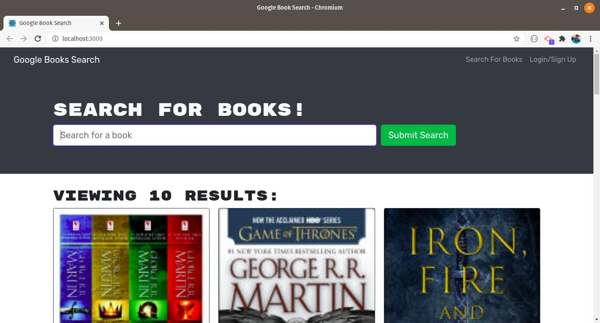

# Book Finder

## Description

Book Finder is a complete MERN application utilizing GraphQL and Apollo Server to interact with the backend. This web app utilizes Google's Book API and allows users to not only find books, but also save them as favorites if they sign up for the app. The app includes the following features:

- Search for books by author, title, or series
- Account creation utilizing MongoDB, GraphQL, and JWT
- Save books for viewing later
- Profile page which will show all saved books
- Remove books from profile

## Table of Contents

- [Installation](#installation)
- [Usage](#usage)
- [Credits](#Credits)
- [Questions](#questions)

## Installation

1. Prerequisite: MongoDB is already installed and configured
2. Clone the repository then run `npm install package.json` to make sure all dependencies are gotten.
3. Run npm start. Concurrently will run both the client and server.

## Usage

Once the server is running, you can connect to localhost:3000 or the deployed application. All data communicates with the backend by using Apollo and GraphQL. Tests can be made at localhost:3001/graphql.

## Credits

http://github.com/mondrovic

## Inquiries

Any questions or inquiries can go to mondrovic1@gmail.com
Matthew Ondrovic
https://githbub.com/mondrovic
